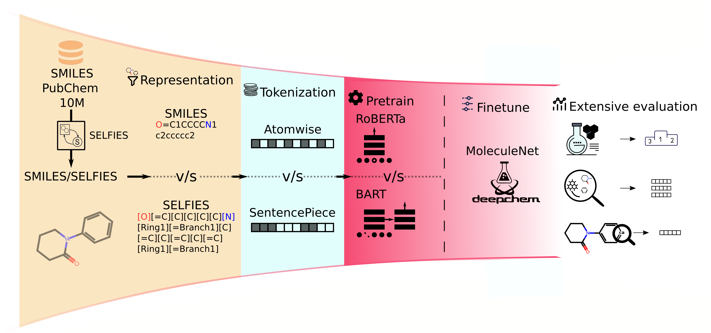

# [Beyond performance: How design choices shape chemical language models](https://www.biorxiv.org/content/10.1101/2025.05.23.655735v1)
## Abstract
> Chemical language models (CLMs) have shown strong performance in molecular property prediction and generation tasks. However, the impact of design choices, such as molecular representation format, tokenization strategy, and model architecture, on both performance and chemical interpretability remains underexplored. In this study, we systematically evaluate how these factors influence CLM performance and chemical understanding. We evaluated models through finetuning on downstream tasks and probing the structure of their latent spaces using simple classifiers and dimensionality reduction techniques. Despite similar performance on downstream tasks across model configurations, we observed substantial differences in the structure and interpretability of their internal representations. SMILES molecular representation format with atomwise tokenization strategy consistently produced more chemically meaningful embeddings, while models based on BART and RoBERTa architectures yielded comparably interpretable representations. These findings highlight that design choices meaningfully shape how chemical information is represented, even when external metrics appear unchanged. This insight can inform future model development, encouraging more chemically grounded and interpretable CLMs.

## Usage
We provide the code to replicate the pre-training of our models in b), but we suggest to download the pre-trained models as explained in a) to save resources.  
### Load environment
The fairseq framework has hit end of service, since we started our project, which resulted in using two different fairseq versions and conda environments for pre-training because of this.
- For **RoBERTa**, fine-tuning and the analysis just load the environment:
    - `conda env create -f SMILES_OR_SELFIES.yml`
- For **BART** pre-training you additionally need to download the nightly version of fairseq:
    - `conda env create -f fairseq_git.yml`
    - `git clone https://github.com/facebookresearch/fairseq.git`
### a) Download the pre-trained models
1. Download the models and tokenisers from our [Zenodo record](https://zenodo.org/records/16926537)
1. Unpack the models to the path specified in _constants.py_

### b) Pre-training pipeline
1. Install environment with _make build-conda-from-env_
1. Download data with _make download-10m_
1. Preprocess with _preprocessing.py_
1. Create tokenisers with _tokenisation.py_
1. Parse with _parsing.py_
1. Preprocess for fairseq:
    - `fairseq-preprocess --only-source --destdir fairseq_preprocess/selfies_atom_isomers --trainpref processed/selfies_atom_isomers  --validpref processed/selfies_atom_isomers_val`
1. Pre-train a model with:
    -  `fairseq-train fairseq_preprocess/selfies_atom_isomers --save-dir fairseq/selfies_atom_isomers --wandb-project pre-train --batch-size 32 --tokens-per-sample 512 --total-num-update 500000 --max-update 500000 --warmup-updates 1500 --task masked_lm --save-interval 1 --arch roberta_base --optimizer adam --lr-scheduler polynomial_decay --lr 1e-05 --dropout 0.1 --criterion masked_lm --max-tokens 3200 --weight-decay 0.01 --attention-dropout 0.2 --clip-norm 1.0 --skip-invalid-size-inputs-valid-test --log-format json --log-interval 1000 --save-interval-updates 5000 --keep-interval-updates 1 --update-freq 4 --seed 4 --distributed-world-size 1 --no-epoch-checkpoints --dataset-impl mmap --num-workers 4`
### Downstream results
1. Run the "training pipeline" from above
1. Create and prepare MolNet datasets with _dataset.py_
1. Train different hyperparams with _hyperparameter\_search.py_
   - Get scores with _scoring.py_, adapt the path
   - Check results in _Scoring\_report\_hyperparameters.ipynb_
   - Adapt _BEST_PARAMS_ in _hyperparameters.py_
1. Run finetuning with _finetuning.py_ giving the CUDA-GPU and the model configuration
   - Get scores with _scoring.py_, adapt the path
   - Check results in _Scoring\_report\_MolNet.ipynb_
### Weak estimators
1. Run the "training pipeline" from above
1. Train weak estimators in _embedding\_classification.py_ 
1. Check results in _Scoring\_report\_weak\_estimators\_RDKit.ipynb_
### Molecule embedding plots
1. Run the "training pipeline" from above
1. Run _embedding_maps.py_ and find the plots in _plots/_
### Atom embedding
1. Run the "training pipeline" from above
1. INKEN PIPELINE!!!
### Atom regression
1. Run the "training pipeline" from above
1. Download data with _make download-eth_ into `download_eth/`
1. Preprocess dataset with _dashMolecules.py_
1. INKEN PIPELINE!!!
1. GET PREPROCESSING OUT OF ZZZ\_token\_level\_prototype.ipynb
1. Train the weak regressors with _atom_embeds.py_
1. Read out results in _Scoring\_report\_atom-level\_analysis.ipynb_

## Contact
If there are questions, please file a [GitHub issue](https://github.com/ibmm-unibe-ch/SMILES_or_SELFIES/issues) or send an e-mail to thomas.lemmin@unibe.ch, inken.fender@unibe.ch, and jannik.gut@unibe.ch.